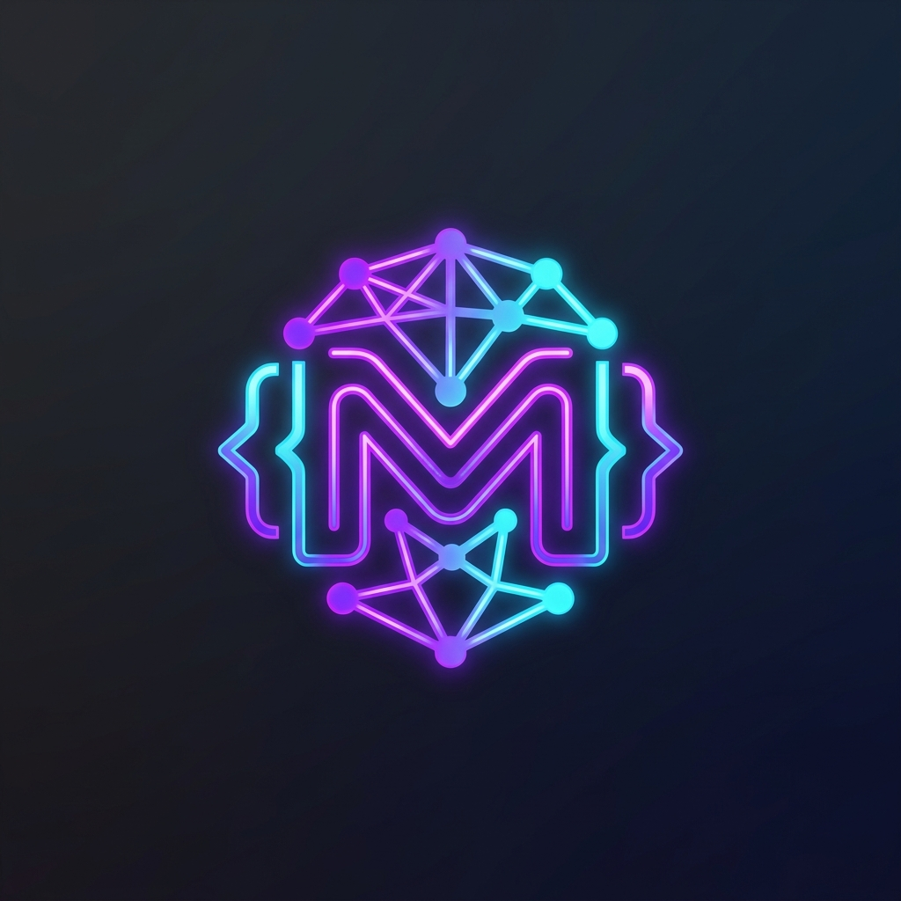

<p align="center">
  
</p>

# Antigravity MiniMax M3 Integration

This repository provides a custom skill for Google Antigravity 2.0 that integrates MiniMax's **`MiniMax-M3`** model directly into your agent environment. It is designed to save you tokens and provide robust alternative reasoning and code generation capabilities by offloading specific generation tasks to MiniMax.

## Features
- **Native Skill Integration:** Your Antigravity agents can query MiniMax programmatically.
- **Cost-Saving Workflows:** Includes a `--code-only` argument that forces MiniMax to output raw, executable code directly to your project files, bypassing Antigravity's context window entirely.
- **Auditing and Alternatives:** Great for generating alternative implementations or auditing codebase architectures without saturating your primary agent's token limit.

---

## 1. Environment Setup

You need to add your MiniMax API credentials to your shell configuration (e.g., `~/.bashrc`, `~/.zshrc`, or `~/.config/fish/config.fish`).

Append the following exports to your shell config file:

```bash
# MiniMax API configuration for Antigravity
export MINIMAX_API_KEY="<YOUR_MINIMAX_API_KEY>"
export MINIMAX_BASE_URL="https://api.minimax.io/v1"
```

Restart your terminal or run `source ~/.bashrc`.

---

## 2. Install Dependencies

The integration uses the standard OpenAI Python SDK to connect to MiniMax's API (which is OpenAI compatible). Install it globally:

```bash
pip install openai --break-system-packages
```

---

## 3. Deployment

Because Antigravity protects its system configuration folder, you must copy it manually or use an agent with `unsandboxed(bash)` permissions.

**Manual Installation:**
Copy the `minimax-plugin` folder from this repository into your Antigravity plugins directory:

```bash
cp -r minimax-plugin ~/.gemini/config/plugins/
```

**Agent Installation:**
Alternatively, ask your Antigravity agent:
> *"Please copy the `minimax-plugin` folder from this project into your `~/.gemini/config/plugins/` directory using unsandboxed bash."*

---

## 4. How to Save on Tokens (Usage Guide)

When you use this integration, two separate token economies are running simultaneously. To keep costs low on the Antigravity side, you must prevent the agent from reading massive file outputs into its own context.

### A. Direct-to-File Code Generation
Tell the agent to write code **directly to a file** using MiniMax.

**Prompt Example:**
> *"Use MiniMax to write a Python parser script and save it to `parser.py`"*

**What happens:** Antigravity runs the script using the `--code-only` flag. MiniMax writes the raw code directly to `parser.py`. Antigravity **never reads the output**, saving you thousands of orchestration tokens.

### B. Bulk Code Refactoring & Audits
**Prompt Example:**
> *"Send `app.py` to MiniMax and ask it to audit the architecture and security, save report to `audit.md`"*

**What happens:** Antigravity passes the file to MiniMax. MiniMax analyzes it and writes the result. Antigravity stays completely out of the heavy reading.

---

## 5. Documentation & Wiki

For advanced architecture logic and extended token-saving workflows, please refer to the official [Antigravity MiniMax M3 Integration Wiki](https://github.com/DamirLukina88/-Antigravity-MINIMAX-M3-CODE-integration/wiki).
